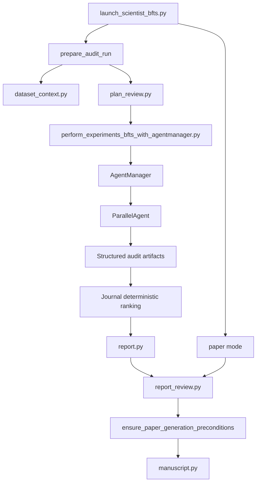

# AI-bench-auditor Architecture

This document describes the implemented architecture of AI-bench-auditor as it exists in the repository today. It is intended to be the technical reference for the README, the verification guide, and the execution log.

## Design Goals

The system is built around a few non-negotiable constraints:

- benchmark audits must be grounded in deterministic, machine-validated artifacts
- human approval must happen before research begins when plan review is required
- audit-mode branch acceptance must not depend primarily on LLM narration of stdout
- paper generation must consume a validated audit run, never raw benchmark inputs
- manuscript outputs must be blocked when the verification-stack summary does not pass the required preconditions
- the tracked repository must stay runnable in local development without requiring large external benchmark downloads

## High-Level System Shape

At a high level, the repository has four cooperating layers:

1. Control plane
   `launch_scientist_bfts.py` validates CLI arguments, prepares run directories, triggers plan review, orchestrates audit versus paper mode, promotes artifacts, runs report review, and enforces manuscript gates.
2. Search plane
   `ai_scientist/treesearch/` provides the reused AI Scientist v2 search loop, but audit tasks replace training-centric stage goals, prompts, node parsing, and ranking logic.
3. Artifact plane
   `ai_scientist/audits/` defines schemas, dataset context, plan-review contracts, artifact validators, reports, report review, manuscript generation, and the deterministic verification stack.
4. Verification plane
   `ai_scientist.audits.verification` materializes deterministic audit bundles from checked-in fixtures and produces the summary artifact consumed by the manuscript gate.



## Major Modules

### Launcher and orchestration

- `launch_scientist_bfts.py`
  - parses `audit` and `paper` modes
  - prepares an audit run directory and copied config
  - enriches the idea/spec with dataset context
  - enforces plan review through `ensure_plan_review(...)`
  - runs the tree-search executor in audit mode
  - promotes the winning bundle’s artifacts to the top-level run directory
  - generates `audit_report.md`
  - runs automated report review
  - blocks or allows manuscript generation based on the verification summary
  - resolves nested artifact bundles when paper mode is run against an older or partially promoted run directory

### Audit artifact and workflow modules

- `ai_scientist/audits/schema.py`
  - JSON-schema validators for `audit_results.json`, `split_manifest.json`, and `metrics_before_after.json`
  - findings-table column contract
  - provenance builders and example payloads
- `ai_scientist/audits/dataset_context.py`
  - stages benchmark files into the run directory
  - computes dataset fingerprints
  - infers lightweight split metadata
  - writes `dataset_card.md`
  - emits `split_manifest.json`
- `ai_scientist/audits/research_plan.py`
  - builds `research_plan.json`
  - renders `research_plan.md`
  - fingerprints plan content so approvals can tie back to a concrete plan revision
- `ai_scientist/audits/plan_review.py`
  - writes `plan_review_state.json`, `plan_approval.json`, and optional `plan_feedback.md`
  - supports `interactive`, `file`, `skip`, and explicit `--approve-plan` flows
- `ai_scientist/audits/artifacts.py`
  - loads and validates a completed audit bundle as a coherent unit
  - checks schema validity, findings summary consistency, provenance alignment, and evidence-file existence
- `ai_scientist/audits/report.py`
  - generates deterministic `audit_report.md` directly from validated artifact paths
- `ai_scientist/audits/report_review.py`
  - checks that the report contains the evidence-backed sections and wording required for manuscript eligibility
  - optionally regenerates the report if the issues are fixable
- `ai_scientist/audits/manuscript.py`
  - builds `paper.tex`, tables, figures, references, appendix material, `paper_manifest.json`, and optional `paper.pdf`
- `ai_scientist/audits/verification.py`
  - runs the repo-native verification stack and writes `verification_stack_results.json`

### Search integration modules

- `ai_scientist/treesearch/agent_manager.py`
  - swaps the original stage titles and goals for audit-native ones
  - decides stage completion using validated audit artifacts instead of plot polish
  - preserves the four-stage scaffold while changing success criteria
- `ai_scientist/treesearch/parallel_agent.py`
  - detects audit tasks from the task description
  - rewrites prompts toward deterministic audit work
  - validates structured artifacts after code execution
  - accepts or rejects nodes based on audit artifacts
- `ai_scientist/treesearch/journal.py`
  - ranks audit nodes deterministically by `audit_score`, evidence coverage, remediation confirmation, reproducibility signal, then node ID
- `ai_scientist/treesearch/perform_experiments_bfts_with_agentmanager.py`
  - prepares the workspace, runs the manager loop, and returns the final manager so the launcher can locate the winning node

## Audit-Mode Lifecycle

### 1. CLI parsing and argument validation

`launch_scientist_bfts.py` accepts `--mode audit` and `--mode paper`. Audit mode consumes a benchmark idea/spec JSON; paper mode requires an `audit_run_dir` containing `audit_run_metadata.json`.

### 2. Audit run preparation

`prepare_audit_run(...)` does the following:

- loads the selected idea/spec
- writes `idea.md`
- optionally injects accompanying code or dataset-reference code
- calls `augment_idea_with_dataset_context(...)`
- writes the enriched `idea.json`
- copies and edits the BFTS config into the run directory
- writes `audit_run_metadata.json`

The copied config is also where CPU-safe audit defaults such as `agent.num_workers = 1` are applied.

### 3. Dataset-context materialization

`dataset_context.py` is the first deterministic artifact stage. It:

- copies declared benchmark files into the run directory
- computes a stable dataset fingerprint
- derives split-level metadata
- records inferred candidate keys, target columns, and timestamp columns when possible
- writes `dataset_card.md`
- writes `split_manifest.json`

The enriched benchmark metadata is injected back into `idea.json`, so downstream prompts and reports work from a grounded task description.

### 4. Research plan and approval gate

`ensure_plan_review(...)` writes the initial research plan before any search begins.

Artifacts written here:

- `research_plan.json`
- `research_plan.md`
- `plan_review_state.json`
- `plan_approval.json`
- optional `plan_feedback.md`

The launcher stops before experiment execution when approval is missing and review is required.

### 5. Tree-search execution

`perform_experiments_bfts(...)` prepares the AI Scientist workspace, loads the task description, and runs `AgentManager.run(...)`.

The search scaffold is preserved, but audit tasks change its meaning:

- Stage 1: reproduce benchmark protocol
- Stage 2: run leakage detectors
- Stage 3: confirm findings with remediation
- Stage 4: robustness and audit synthesis

### 6. Audit-specific branch execution

`ParallelAgent` changes both prompting and post-execution behavior for audit tasks.

Prompt changes:

- prefer `pandas`, `scikit-learn`, `duckdb`, `rapidfuzz`, `pyarrow`, and `numpy`
- require emission of:
  - `audit_results.json`
  - `split_manifest.json`
  - `metrics_before_after.json`
  - `findings.csv` or `findings.parquet`
- discourage training-era boilerplate unless the benchmark explicitly requires it

Post-execution changes:

- `parse_exec_result(...)` validates structured audit artifacts directly from the node’s working directory
- valid artifacts set `node.analysis` from the structured summary
- valid artifacts set `node.metric` from `audit_results.json`
- missing or invalid artifacts mark the node invalid instead of letting stdout parsing rescue it

### 7. Audit-specific stage completion

`AgentManager._evaluate_audit_stage_completion(...)` uses validated artifacts to decide whether each stage is complete.

Examples:

- Stage 1 requires baseline protocol validation through `dataset_card.md`, `split_manifest.json`, and `audit_results.json`
- Stage 2 requires either a confirmed finding with evidence or a high-confidence clean audit
- Stages 3 and 4 require `metrics_before_after.json` when findings remain open

### 8. Deterministic best-node selection

`Journal.get_best_node(...)` bypasses the legacy LLM selection path whenever audit artifacts are available.

Current precedence:

1. higher audit score
2. higher evidence coverage
3. stronger remediation confirmation
4. presence of reproducibility signal
5. higher reproducibility signal
6. stable node-ID tie break

### 9. Report generation and artifact promotion

After search finishes, the launcher:

- copies `logs/0-run/experiment_results/` to top-level `experiment_results/`
- finds the winning node’s artifact directory
- writes `audit_report.md` into that bundle
- promotes key artifacts to the top-level run directory

Promoted artifacts include:

- `dataset_card.md`
- `audit_results.json`
- `split_manifest.json`
- `findings.csv` or `findings.parquet`
- optional `metrics_before_after.json`
- `audit_report.md`
- `evidence/` when present

The promoted paths may be symlinks or copies.

### 10. Report review and manuscript gate

`run_post_audit_review_and_paper(...)` always runs report review first.

It writes:

- `audit_report_review.json`
- `audit_report_review.md`

If `paper_mode` is not `off`, the launcher then evaluates the verification summary through `ensure_paper_generation_preconditions(...)`.

The manuscript stage only runs if:

- overall verification status is `passed`
- schema gate passed
- canary summary passed
- mutation summary passed
- search ablation summary passed
- search ablation reports `full_tree_search_adds_value = true`
- reproducibility summary passed

## Paper-Mode Lifecycle

Paper mode is intentionally narrower than audit mode.

Inputs:

- `audit_run_dir`
- optional citation and PDF flags
- optional `verification_stack_results.json` override

Behavior:

- validate that the run directory really came from audit mode
- locate the active artifact bundle
- promote nested artifacts to the top-level run directory if needed
- rerun audit-report review
- reapply the verification gate
- build the manuscript bundle

Paper mode never accepts raw benchmark input directly.

## Run Directory Contract

A typical run directory looks like:

```text
run_dir/
  idea.json
  idea.md
  bfts_config.yaml
  audit_run_metadata.json
  dataset_card.md
  research_plan.json
  research_plan.md
  plan_review_state.json
  plan_approval.json
  experiment_results/
    experiment_node-.../
      audit_results.json
      split_manifest.json
      findings.csv
      metrics_before_after.json
      audit_report.md
      evidence/
  audit_results.json
  split_manifest.json
  findings.csv
  audit_report.md
  audit_report_review.json
  audit_report_review.md
  evidence/
  paper/
  paper_bundle.zip
```

The top-level artifact set is intentionally easy for a human reviewer to inspect without digging into the nested search logs.

## Verification Stack Architecture

The repo-native verification stack exists to keep the core acceptance logic deterministic and runnable in local development and CI.

Default phases:

1. Canary suite
   Uses generated canary cases for exact duplicates, near duplicates, group overlap, temporal leakage, preprocessing leakage, suspicious-feature leakage, and a clean negative control.
2. Mutation harness
   Injects one leakage mode at a time into a clean benchmark base and measures recovery.
3. Search ablation
   Compares `detector_only`, `one_shot_agent`, and `full_tree_search`.
4. Reproducibility
   Repeats `full_tree_search` multiple times and checks material consistency.
5. Acceptance
   Runs repo-native acceptance benchmarks and writes acceptance reports.
6. Schema gate
   Validates all generated bundles and summary artifacts.

The default registry lives at `tests/fixtures/verification/registry.json`.

## External Dependencies and Runtime Assumptions

Core runtime dependencies are declared in `requirements.txt`, including:

- `pandas`
- `scikit-learn`
- `pyarrow`
- `duckdb`
- `rapidfuzz`
- `psutil`

Optional runtime capabilities:

- TeX toolchain for PDF compilation
- model/API credentials for live LLM-backed search
- real benchmark data staged outside the tracked tree

`cleanup_processes()` now tolerates a missing `psutil` import, but the dependency is still declared because non-dry-run cleanup is expected to use it.

## Known Boundaries

- The verification harness is repo-native and fixture-based by design. It is a strong local correctness gate, not a universal benchmark-validation claim.
- The supplemental real-benchmark inspection memo under `docs/artifact_inspection_real_benchmark.md` documents local ignored runs under `downloads/`; it is not part of the tracked default verification path.
- Legacy non-audit AI Scientist codepaths remain in the repository for compatibility, but the user-facing benchmark-audit flow is defined by the audit-specific path described here.

## Extension Points

Common places to extend the system safely:

- add new deterministic detectors in `ai_scientist/audits/detectors.py`
- extend schemas in `ai_scientist/audits/schema.py`
- add new verification benchmarks under `tests/fixtures/verification/`
- strengthen manuscript sections in `ai_scientist/audits/manuscript.py`
- refine audit-stage goals and completion rules in `ai_scientist/treesearch/agent_manager.py`

When adding new behavior, the safest pattern is:

1. define or extend the artifact contract first
2. add deterministic validators and tests
3. wire the new artifact into audit parsing and ranking
4. update the verification stack and docs together
