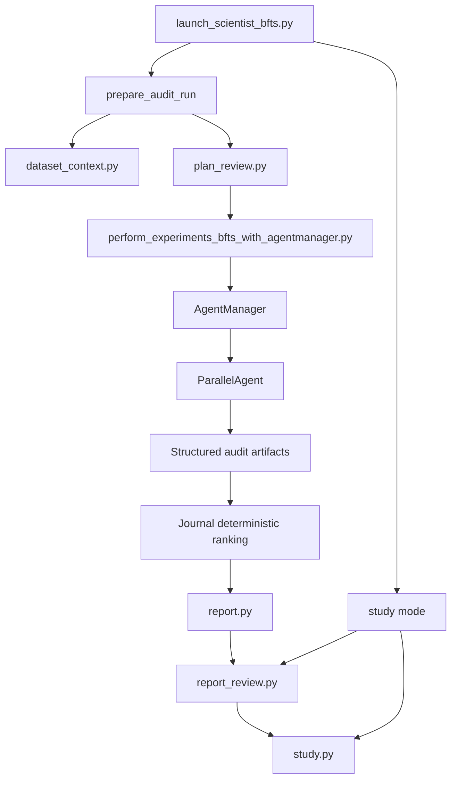

# AI-bench-auditor Architecture

This document describes the implemented architecture of AI-bench-auditor as it exists in the repository today. It is the current technical reference for the CLI flow, artifact contracts, and the markdown-first study bundle surface.

## Design Goals

The system is built around a few non-negotiable constraints:

- benchmark audits must be grounded in deterministic, machine-validated artifacts
- human approval must happen before research begins when plan review is required
- audit-mode branch acceptance must not depend primarily on LLM narration of stdout
- the final user-facing output should be easy for another LLM or human reviewer to consume directly
- the tracked repository must stay runnable in local development without requiring large external benchmark downloads

## High-Level System Shape

At a high level, the repository has four cooperating layers:

1. Control plane
   `launch_scientist_bfts.py` validates CLI arguments, prepares run directories, triggers plan review, orchestrates audit versus study mode, promotes artifacts, runs report review, and builds the study bundle.
2. Search plane
   `ai_scientist/treesearch/` provides the reused AI Scientist v2 search loop, but audit tasks replace training-centric stage goals, prompts, node parsing, and ranking logic.
3. Artifact plane
   `ai_scientist/audits/` defines schemas, dataset context, plan-review contracts, artifact validators, reports, report review, study-bundle generation, and supporting output utilities.
4. Verification plane
   `ai_scientist.audits.verification` materializes deterministic audit bundles from checked-in fixtures and produces the summary artifacts used to verify audit correctness and search quality in development and CI.



## Major Modules

### Launcher and orchestration

- `launch_scientist_bfts.py`
  - parses `audit` and `study` modes
  - prepares an audit run directory and copied config
  - enriches the idea/spec with dataset context
  - enforces plan review through `ensure_plan_review(...)`
  - runs the tree-search executor in audit mode
  - promotes the winning bundle’s artifacts to the top-level run directory
  - generates `audit_report.md`
  - runs automated report review
  - builds the final `study_report.md`, `study_bundle_manifest.json`, and optional `study_figures.zip`
  - resolves nested artifact bundles when `study` mode is run against an older or partially promoted run directory

### Audit artifact and workflow modules

- `ai_scientist/audits/schema.py`
  - JSON-schema validators for `audit_results.json`, `split_manifest.json`, and `metrics_before_after.json`
  - findings-table column contract
  - provenance builders and example payloads
- `ai_scientist/audits/dataset_context.py`
  - stages benchmark files into the run directory
  - computes dataset fingerprints
  - infers lightweight split metadata
  - writes `dataset_card.md`
  - emits `split_manifest.json`
- `ai_scientist/audits/research_plan.py`
  - builds `research_plan.json`
  - renders `research_plan.md`
  - fingerprints plan content so approvals can tie back to a concrete plan revision
- `ai_scientist/audits/plan_review.py`
  - writes `plan_review_state.json`, `plan_approval.json`, and optional `plan_feedback.md`
  - supports `interactive`, `file`, `skip`, and explicit `--approve-plan` flows
- `ai_scientist/audits/artifacts.py`
  - loads and validates a completed audit bundle as a coherent unit
  - checks schema validity, findings summary consistency, provenance alignment, and evidence-file existence
- `ai_scientist/audits/report.py`
  - generates deterministic `audit_report.md` directly from validated artifact paths
- `ai_scientist/audits/report_review.py`
  - checks that the report contains the evidence-backed sections and wording required for final bundle eligibility
  - optionally regenerates the report if the issues are fixable
- `ai_scientist/audits/study.py`
  - generates `study_report.md`, `study_bundle_manifest.json`, `study_figures/`, and optional `study_figures.zip`
  - embeds raw methodology and artifact references so the output is LLM-readable without LaTeX or PDF conversion
- `ai_scientist/audits/verification.py`
  - runs the repo-native verification stack and writes `verification_stack_results.json`

### Search integration modules

- `ai_scientist/treesearch/agent_manager.py`
  - swaps the original stage titles and goals for audit-native ones
  - decides stage completion using validated audit artifacts instead of plot polish
  - preserves the four-stage scaffold while changing success criteria
- `ai_scientist/treesearch/parallel_agent.py`
  - detects audit tasks from the task description
  - rewrites prompts toward deterministic audit work
  - validates structured artifacts after code execution
  - accepts or rejects nodes based on audit artifacts
- `ai_scientist/treesearch/journal.py`
  - ranks audit nodes deterministically by `audit_score`, evidence coverage, remediation confirmation, reproducibility signal, then node ID
- `ai_scientist/treesearch/perform_experiments_bfts_with_agentmanager.py`
  - prepares the workspace, runs the manager loop, and returns the final manager so the launcher can locate the winning node

## Audit-Mode Lifecycle

### 1. CLI parsing and argument validation

`launch_scientist_bfts.py` accepts `--mode audit` and `--mode study`. Audit mode consumes a benchmark idea/spec JSON; study mode requires an `audit_run_dir` containing `audit_run_metadata.json`.

### 2. Audit run preparation

`prepare_audit_run(...)` does the following:

- loads the selected idea/spec
- writes `idea.md`
- optionally injects accompanying code or dataset-reference code
- calls `augment_idea_with_dataset_context(...)`
- writes the enriched `idea.json`
- copies and edits the BFTS config into the run directory
- writes `audit_run_metadata.json`

The copied config is also where CPU-safe audit defaults such as `agent.num_workers = 1` are applied.

### 3. Dataset-context materialization

`dataset_context.py` is the first deterministic artifact stage. It:

- copies declared benchmark files into the run directory
- computes a stable dataset fingerprint
- derives split-level metadata
- records inferred candidate keys, target columns, and timestamp columns when possible
- writes `dataset_card.md`
- writes `split_manifest.json`

The enriched benchmark metadata is injected back into `idea.json`, so downstream prompts and reports work from a grounded task description.

### 4. Research plan and approval gate

`ensure_plan_review(...)` writes the initial research plan before any search begins.

Artifacts written here:

- `research_plan.json`
- `research_plan.md`
- `plan_review_state.json`
- `plan_approval.json`
- optional `plan_feedback.md`

The launcher stops before experiment execution when approval is missing and review is required.

### 5. Tree-search execution

`perform_experiments_bfts(...)` prepares the AI Scientist workspace, loads the task description, and runs `AgentManager.run(...)`.

The search scaffold is preserved, but audit tasks change its meaning:

- Stage 1: reproduce benchmark protocol
- Stage 2: run leakage detectors
- Stage 3: confirm findings with remediation
- Stage 4: robustness and audit synthesis

### 6. Audit-specific branch execution

`ParallelAgent` changes both prompting and post-execution behavior for audit tasks.

Prompt changes:

- prefer `pandas`, `scikit-learn`, `duckdb`, `rapidfuzz`, `pyarrow`, and `numpy`
- require emission of:
  - `audit_results.json`
  - `split_manifest.json`
  - `metrics_before_after.json`
  - `findings.csv` or `findings.parquet`
- discourage training-era boilerplate unless the benchmark explicitly requires it

Post-execution changes:

- `parse_exec_result(...)` validates structured audit artifacts directly from the node’s working directory
- valid artifacts set `node.analysis` from the structured summary
- valid artifacts set `node.metric` from `audit_results.json`
- missing or invalid artifacts mark the node invalid instead of letting stdout parsing rescue it

### 7. Audit-specific stage completion

`AgentManager._evaluate_audit_stage_completion(...)` uses validated artifacts to decide whether each stage is complete.

Examples:

- Stage 1 requires baseline protocol validation through `dataset_card.md`, `split_manifest.json`, and `audit_results.json`
- Stage 2 requires either a confirmed finding with evidence or a high-confidence clean audit
- Stages 3 and 4 require `metrics_before_after.json` when findings remain open

### 8. Deterministic best-node selection

`Journal.get_best_node(...)` bypasses the legacy LLM selection path whenever audit artifacts are available.

Current precedence:

1. higher audit score
2. higher evidence coverage
3. stronger remediation confirmation
4. presence of reproducibility signal
5. higher reproducibility signal
6. stable node-ID tie break

### 9. Report generation and artifact promotion

After search finishes, the launcher:

- copies `logs/0-run/experiment_results/` to top-level `experiment_results/`
- finds the winning node’s artifact directory
- writes `audit_report.md` into that bundle
- promotes key artifacts to the top-level run directory

Promoted artifacts include:

- `dataset_card.md`
- `audit_results.json`
- `split_manifest.json`
- `findings.csv` or `findings.parquet`
- optional `metrics_before_after.json`
- `audit_report.md`
- `evidence/` when present

The promoted paths may be symlinks or copies.

### 10. Report review and study bundle

`run_post_audit_review_and_study_bundle(...)` runs report review first.

It writes:

- `audit_report_review.json`
- `audit_report_review.md`

If review passes, the launcher then builds the study surface through `build_audit_study_bundle(...)`.

The study stage writes:

- `study_report.md`
- `study_bundle_manifest.json`
- `study_figures/`
- optional `study_figures.zip`

The study report is intentionally markdown-first and artifact-linked. It includes methodology, run metadata, split inventory, detector coverage, findings, evidence registry, remediation deltas, report-review status, figure inventory, and embedded copies of key markdown artifacts such as the research plan and dataset card.

## Study-Mode Lifecycle

Study mode is intentionally narrower than audit mode.

Inputs:

- a validated audit run directory
- top-level promoted artifacts or a single resolvable artifact bundle under `experiment_results/`

Behavior:

- validates the run contract through `audit_run_metadata.json`
- resolves the active artifact bundle
- republishes promoted artifacts to the run root if needed
- reruns `review_audit_report(...)`
- rebuilds the markdown-first study bundle

Study mode does not accept raw benchmark input.

## Expected Run Layout

An audit run typically contains:

```text
run_dir/
  audit_run_metadata.json
  bfts_config.yaml
  idea.json
  dataset_card.md
  research_plan.json
  research_plan.md
  plan_review_state.json
  plan_approval.json
  audit_results.json
  split_manifest.json
  findings.csv
  metrics_before_after.json
  audit_report.md
  audit_report_review.json
  audit_report_review.md
  study_report.md
  study_bundle_manifest.json
  study_figures/
  study_figures.zip
  experiment_results/
  evidence/
```

## Extension Points

Current extension points include:

- adding new detectors in `ai_scientist/audits/detectors.py`
- tightening schema requirements in `ai_scientist/audits/schema.py`
- refining report-review criteria in `ai_scientist/audits/report_review.py`
- expanding figure generation or markdown bundle sections in `ai_scientist/audits/study.py`
- extending deterministic verification benchmarks under `tests/fixtures/verification/`

## Operational Notes

- The final product surface is `study_report.md` plus the raw JSON/CSV artifacts and figure zip, not LaTeX or PDF outputs.
- The verification stack remains useful for local correctness and search-quality regression detection, but the final study bundle is built directly from validated audit artifacts and report review rather than document-compilation tooling.
- Real external benchmark runs should still live outside the tracked source tree.
